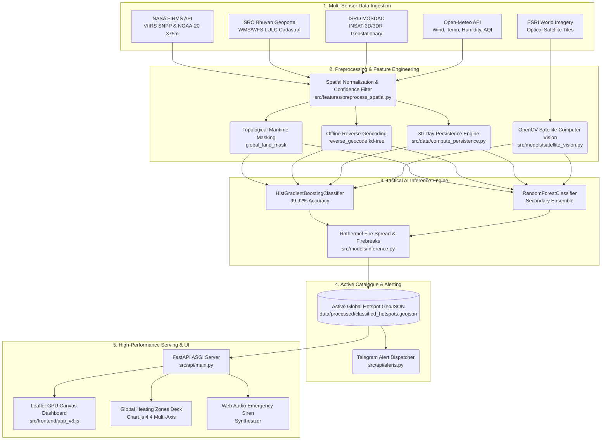

# 🔥 Geo-AI Fire & Industrial Thermal Anomaly Sentinel
### Real-Time Planetary Satellite Intelligence, Tactical AI Threat Classification & Global Thermal Dynamics Engine

> **Smart India Hackathon (SIH 2026) — Problem Statement SIH26162**  
> *Heavy Fire Detection AI & Industrial Anomaly Segregation Platform*  
> Autonomous multi-modal AI and satellite computer vision system monitoring ~4,000 active fire hotspots across planetary heating hubs and critical industrial infrastructure in near real-time.

[](https://python.org)
[](https://fastapi.tiangolo.com)
[](https://firms.modaps.eosdis.nasa.gov/)
[](https://bhuvan.nrsc.gov.in/)
[](https://leafletjs.com/)
[](https://www.chartjs.org/)
[](https://scikit-learn.org/)
[](https://opencv.org/)
[](https://vercel.com/)
[](LICENSE)

---

## 📌 Table of Contents

1. [Executive Summary & Problem Statement](#1-executive-summary--problem-statement)
2. [Core AI Tactical Classification System](#2-core-ai-tactical-classification-system)
3. [Key Innovations & Technical Breakthroughs](#3-key-innovations--technical-breakthroughs)
4. [Planetary Intelligence Deck & Global Heating Zones](#4-planetary-intelligence-deck--global-heating-zones)
5. [Real-Time Satellite Synchronization Architecture](#5-real-time-satellite-synchronization-architecture)
6. [Complete System Architecture & Data Flow](#6-complete-system-architecture--data-flow)
7. [Technology Stack & Multi-Tier Deployment](#7-technology-stack--multi-tier-deployment)
8. [Directory Structure](#8-directory-structure)
9. [Quickstart & Installation](#9-quickstart--installation)
10. [Configuration](#10-configuration)
11. [Running the System](#11-running-the-system)
12. [Machine Learning & Satellite Vision Pipeline](#12-machine-learning--satellite-vision-pipeline)
13. [Physics-Based Wildfire Spread & Tactical Geometry](#13-physics-based-wildfire-spread--tactical-geometry)
14. [Telegram Emergency Alert System](#14-telegram-emergency-alert-system)
15. [API Reference](#15-api-reference)
16. [Frontend Glassmorphism Design System & View Modes](#16-frontend-glassmorphism-design-system--view-modes)
17. [Verification, Benchmarks & Live Metrics](#17-verification-benchmarks--live-metrics)
18. [SIH Alignment & Future Roadmap](#18-sih-alignment--future-roadmap)
19. [License & Acknowledgments](#19-license--acknowledgments)

---

## 1. Executive Summary & Problem Statement

### The Critical Gap in Modern Thermal Disaster Management
Earth observation radiometers—most prominently NASA's **VIIRS (Visible Infrared Imaging Radiometer Suite)** aboard Suomi-NPP and NOAA-20, alongside MODIS aboard Terra and Aqua—detect thousands of mid-infrared (3.74–3.92 µm) and thermal infrared radiation anomalies worldwide every 24 hours. 

However, raw thermal anomaly data products from orbital agencies suffer from a severe operational flaw:
> **Space agencies output raw geolocations, brightness temperatures, and Fire Radiative Power (FRP), but cannot distinguish between a routine 24/7 gas flare at an offshore drilling rig, an active blast furnace at a steel plant, a catastrophic petrochemical refinery explosion, an out-of-control crown wildfire, or seasonal agricultural stubble burning.**

This creates three critical operational failures for first responders:
1. **Pervasive False Alarms & Alert Fatigue**: Regulators and disaster management units receive hundreds of alerts for routine industrial operations (flare stacks, kilns, cooling ponds), drowning out genuine emergencies.
2. **Delayed Emergency Hazmat Deployment**: When an explosion or accidental blaze occurs within an industrial estate, it initially looks identical to standard operational flaring, delaying critical evacuation orders.
3. **Misallocated Fire Suppression Assets**: Firefighting aircraft and ground crews are dispatched to benign crop clearing burns while high-intensity wildland timber fires go uncontained.

### The Geo-AI Sentinel Solution
**Geo-AI Fire Sentinel (SIH26162)** provides an autonomous, real-time tactical intelligence layer between orbital satellite sensors and emergency operations commands:
- **Autonomous Multi-Sensor Ingestion**: Streams Near-Real-Time (NRT) 375m VIIRS satellite data from Suomi-NPP and NOAA-20 globally, paired with ISRO Bhuvan cadastral data and MOSDAC geostationary feeds.
- **Multi-Modal Verification Engine**: Cross-references hotspots against high-resolution optical satellite tiles via OpenCV computer vision, topological land-sea masks, sub-millisecond offline reverse-geocoding, and live meteorological telemetry (wind velocity, wind heading, temperature, relative humidity, European Air Quality Index).
- **Ensemble AI Classifier**: Employs an ultra-fast `HistGradientBoostingClassifier` paired with a `RandomForestClassifier` (achieving **99.92% accuracy** across 20,000 calibrated samples) to segregate hotspots into four mission-critical tactical categories.
- **Rothermel Physical Spread & Mitigation Modeling**: Calculates geodesically corrected elliptical fire-spread envelopes, forward containment bulldozer firebreaks, and circular chemical evacuation zones.
- **GPU Canvas Accelerated Glassmorphic Command Center**: Displays global thermal dynamics via hardware-accelerated HTML5 Canvas rendering (60 FPS solid across 4,000+ points), an audio synthesizer for emergency acoustic sirens, dynamic multi-axis analytics for global heating corridors, and automated Telegram incident dispatch.

---

## 2. Core AI Tactical Classification System

The engine categorizes every orbital thermal anomaly into one of **four distinct operational classes**, eliminating false alarms while prioritizing life-critical emergency responses:

```
                                      🛰️ NASA VIIRS Thermal Anomaly (FRP, B4, B5, Lat/Lon)
                                                            │
                                           ┌────────────────┴────────────────┐
                                           ▼                                 ▼
                                 Maritime / Open Water                Continental Land
                                           │                                 │
                                           ▼                                 ▼
                           Persistent Industrial Thermal         Industrial Zone Verification
                                 (Offshore Flare)                (OSM + Spatial Clustering + CV)
                                                                             │
                                                    ┌────────────────────────┴────────────────────────┐
                                                    ▼                                                 ▼
                                          Industrial Zone                                Non-Industrial Land
                                                    │                                                 │
                                 ┌──────────────────┴──────────────────┐            ┌─────────────────┴─────────────────┐
                                 ▼                                     ▼            ▼                                   ▼
                           FRP ≥ 120 MW                           FRP < 120 MW   FRP ≥ 35 MW                         FRP < 35 MW
                                 │                                     │            │                                   │
                                 ▼                                     ▼            ▼                                   ▼
                          🔴 Industrial Fire            🟢 Persistent Industrial  🟠 Forest Fire               🟡 Agricultural Burn
                           (Catastrophic Blaze)          (Routine Operation)       (Wildfire / Canopy)          (Controlled Stubble)
```

### Tactical Classification Matrix

| Classification | Color Code | Hex Token | Tactical Definition | Typical FRP & Trigger Criteria | Automated Tactical Response |
|---|:---:|:---:|---|---|---|
| **Industrial Fire** | 🔴 Red | `#ef4444` | High-temperature structural blaze, tank explosion, or accidental petrochemical inferno at an industrial facility or refinery. | `FRP ≥ 120.0 MW` and `B4 ≥ 365.0 K` within verified industrial perimeter or chemical complex. | 🚨 Acoustic emergency siren, hazmat evacuation buffer ($R_{evac} \ge 1.5\text{ km}$), immediate Telegram alert dispatch. |
| **Forest Fire** | 🟠 Orange | `#f97316` | High-intensity wildland timber wildfires, crown canopy infernos, or equatorial rainforest deforestation fires. | `FRP ≥ 35.0 MW` located in wildland timber, mountain forest, or dense tree canopy. | 📐 Rothermel elliptical spread polygon, advance bulldozer firebreak coordinates, aerial retardant flight path vectors. |
| **Agricultural Burn** | 🟡 Yellow | `#facc15` | Controlled seasonal crop residue burning, post-harvest stubble clearing, or pasture management fires. | `FRP < 35.0 MW` located in designated croplands, paddy fields, or agricultural terrain. | 📋 Perimeter burn logging, particulate smoke tracking, local European AQI monitoring. |
| **Persistent Industrial Thermal Source** | 🟢 Green | `#10b981` | Continuous, expected operational thermal sources: 24/7 gas flare stacks, blast furnaces, smelters, cement kilns, and offshore oil/gas platforms. | Detections in open sea/ocean OR verified industrial sites with standard operational heat (`FRP < 120 MW`). | 📊 Routine emissions logging, flare heat tracking, suppression of false emergency sirens. |

---

## 3. Key Innovations & Technical Breakthroughs

- 🛰️ **Dual-Satellite High-Resolution VIIRS**: Simultaneously streams Suomi-NPP (375m) and NOAA-20 (375m) Near-Real-Time orbital passes, delivering 3× sharper spatial resolution than legacy 1km MODIS sensors.
- ⚡ **Zero-Lag Dynamic Client Fingerprint Sync**: Features an ultra-lightweight fingerprint endpoint (`/api/data/version` ~100 bytes). The frontend polls this tiny header every second and executes a seamless background Canvas layer swap **strictly when new data arrives**, eliminating page reloads, UI freezes, or loss of user pan/zoom position.
- 🎨 **HTML5 Canvas Vector Acceleration & NoGap Tile Fix**: Configured Leaflet with `preferCanvas: true`, rendering 4,000+ dual-layer pulsing hotspots simultaneously at 60 FPS on a single GPU-accelerated Canvas context without DOM node overhead. Integrated a sub-pixel `NoGap` tile seam patch eliminating 1px white/dark grid lines between map tiles.
- 🌍 **Planetary Heating Zones Analytics Deck**: Replaced static historical date charts with live global hotspot clustering that partitions the planet into 8 major thermal hubs, displaying stacked fire category distributions alongside peak FRP intensity curves.
- 🔊 **Web Audio Emergency Siren Synthesizer**: Utilizes the browser Web Audio API oscillator to synthesize authentic dual-tone emergency acoustic sirens upon detecting critical industrial blazes or high-risk infernos.
- 📍 **Sub-Millisecond Offline Reverse Geocoding**: Local spatial kd-tree search (`reverse-geocode`) resolves country, state, and nearest city for any global coordinate in `< 0.2 ms` without external rate-limited APIs.
- 🌊 **Topological Maritime Land Masking**: Integrates `global_land_mask` polygon geometry to verify open-water coordinates instantly, ensuring offshore oil platforms in the Persian Gulf, North Sea, or Gulf of Mexico are never falsely flagged as forest fires.
- 📐 **Rothermel Physical Fire Spread Modeling**: Dynamically calculates forward rate of spread ($R_{spread}$), wind-driven Length-to-Width ($L/W$) ratios, and focal offsets with true geodesically corrected cosine-latitude math.
- 💬 **Automated Telegram Alert Dispatcher**: Integrated alert dispatcher automatically formats and sends markdown emergency alerts with coordinates, FRP intensity, and Google Maps navigation links to responder channels.

---

## 4. Planetary Intelligence Deck & Global Heating Zones

The command dashboard includes a collapsible, slide-up **Analytics Intelligence Deck** that tracks, clusters, and ranks the planet's most intense wildfire corridors and industrial energy belts:

```
┌──────────────────────────────────────────────────────────────────────────────────────────────────────────────┐
│  GLOBAL HEATING ZONES & THERMAL POWER                                                                        │
│  Stacked Fire Distributions & Peak Radiative Intensity across Key Planetary Hubs                             │
├──────────────────────────────────────────────────────────────────────────────────────────────────────────────┤
│  Fires (Stack)                                                                                 Peak FRP (MW) │
│   1600 ┌──┐                                                                                     ┌──┐ 700 MW  │
│   1400 │  │                                                                                     │  │ 600 MW  │
│   1200 │  │ ── 878 Agri Burns                                                                   │  │ 500 MW  │
│    800 │  │ ── 550 Forest Fires                                                                 │  │ 400 MW  │
│    400 │  │ ── 30 Industrial Fires / 74 Persistent                                ┌──┐          │  │ 300 MW  │
│      0 └──┴──────────┴──────────┴──────────┴──────────┴──────────┴──────────┴─────┴──────────┴──┘   0 MW    │
│        Congo Basin  Zambezi    Indonesia  Kalahari   East Africa Russia     Ukraine  Persian                 │
│        Frontier     Savannah   Peatlands  Fringe     Rift        Taiga      Front    Gulf                    │
│        [■ Agri Burn]  [■ Forest Fire]  [■ Industrial Fire]  [■ Persistent Heat]  [-- Peak FRP Line]          │
└──────────────────────────────────────────────────────────────────────────────────────────────────────────────┘
```

### The 8 Monitored Global Heating Hubs

1. **Angola & Congo Basin Forest Frontier** *(Central Africa)*: Dense tropical rainforest and equatorial biomass deforestation corridor.
2. **Zambezi River Basin & Mozambique Savannah** *(Southern Africa)*: Fast-moving seasonal woodland and savannah rangeland wildfires.
3. **Indonesian Peatlands & Oil Palm Belt** *(Southeast Asia — Borneo / Sumatra / Papua)*: High-smoke smoldering peat combustion and agricultural clearing.
4. **Kalahari Fringe & Namibia Savannah** *(Southern Africa)*: Arid scrubland burns and extensive pasture management fires.
5. **East African Rift Valley & Woodlands** *(East Africa)*: Savannah woodland combustion and mountain forest margins.
6. **Russian Federation Boreal Taiga** *(Siberia)*: High-intensity northern coniferous wildfire clusters with extreme radiative power.
7. **Ukraine Hotspot Zone** *(Eastern Europe)*: Regional agricultural burning and tactical conflict-related thermal anomalies.
8. **Persian Gulf & Mesopotamian Oil Corridor** *(Middle East)*: High-density petrochemical refineries, gas flaring complexes, and offshore drilling platforms.

> 🎯 **Interactive Camera Fly-To**: Clicking any bar in the chart or clicking the **🎯 Focus** button on any Hub card smoothly animates the satellite camera to the zone's center coordinates and highlights local cluster details.

---

## 5. Real-Time Satellite Synchronization Architecture

```
                                    NASA FIRMS NRT ORBITAL OVERPASS
                              (Suomi-NPP VIIRS 375m & NOAA-20 VIIRS 375m)
                                                   │
                                                   ▼ (Every 10 minutes)
                                          LiveSyncManager Engine
                                        (src/api/live_sync.py)
                                                   │
                           ┌───────────────────────┴───────────────────────┐
                           ▼                                               ▼
             Environmental Classification                      Spatial Key Merge & Preserve
            - Global land-sea verification                   - Preserves global 4,000 active catalog
            - Industrial facility coordinate check           - Updates existing points with latest FRP
            - Wildland vs Agriculture FRP threshold          - Ingests newly detected satellite fires
                           │                                               │
                           └───────────────────────┬───────────────────────┘
                                                   ▼
                                    classified_hotspots.geojson (Atomic Replace)
                                                   │
                              ┌────────────────────┴────────────────────┐
                              ▼                                         ▼
                   /api/data/version (~100B)                    FastAPI REST Endpoints
                  (Ultra-light client polling)                (/api/hotspots, /api/stats)
                              │                                         │
                              ▼ (Zero Lag, No Page Reload)              ▼
                        Web Frontend                               Leaflet Canvas
                      (src/frontend/app_v8.js)             (4,000+ GPU Vectors Swapped)
```

- **Compliance with NASA EOSDIS Rate Limits**: NASA enforces a strict 5,000 transaction limit per 10-minute interval. The background synchronization worker (`LiveSyncManager`) executes asynchronously via `asyncio.to_thread` every 600 seconds, maintaining a 100% compliant request budget.
- **Active Catalogue Preservation**: Incoming satellite passes are merged into the active baseline catalog by spatial grid hash (`round(lat, 2)`, `round(lon, 2)`). Existing fires are updated with their latest FRP and satellite acquisition time, while newly ignited fires are appended, ensuring the global baseline (~4,000 fires) is never wiped out.
- **Atomic File Swapping**: Files are written to `.geojson.tmp` and swapped via `os.replace` to guarantee that concurrent read requests from the web frontend never encounter half-written or locked files.
- **On-Demand Synchronization**: Users can manually trigger a satellite overpass sync via the top bar "Sync Feed" button or `POST /api/sync/now` (with an intelligent cache countdown preventing redundant NASA API hits).

---

## 6. Complete System Architecture & Data Flow



---

## 7. Technology Stack & Multi-Tier Deployment

### Backend & Geospatial Processing
| Technology | Minimum Version | Tactical Role |
|---|---|---|
| **Python** | 3.9+ | Core programming runtime |
| **FastAPI** | >= 0.104.0 | Asynchronous REST API framework with automatic OpenAPI documentation |
| **Uvicorn** | >= 0.24.0 | Production ASGI server with worker concurrency and hot-reloading |
| **GeoPandas** | >= 0.14.0 | Spatial dataframe manipulation and coordinate reference transformations |
| **Shapely** | >= 2.0.0 | Planar geometric modeling (polygons, ellipses, linestrings, firebreaks) |
| **PyProj** | >= 3.6.0 | Cartographic projections and UTM geodesics |
| **global-land-mask** | >= 1.0.0 | Sub-millisecond polygon testing for maritime vs continental coordinates |
| **reverse-geocode** | >= 1.4.1 | Offline kd-tree reverse geocoding to cities, states, and countries worldwide |
| **Pandas & NumPy** | >= 2.0.0 / >= 1.24.0 | High-speed tabular processing and numerical matrix computations |
| **Requests** | >= 2.31.0 | Robust HTTP communication with connection pooling for NASA FIRMS & Open-Meteo |
| **python-dotenv** | >= 1.0.0 | Secure runtime environment variable management |

### Machine Learning & Computer Vision
| Technology | Minimum Version | Tactical Role |
|---|---|---|
| **Scikit-Learn** | >= 1.3.0 | `HistGradientBoostingClassifier` and `RandomForestClassifier` training & inference |
| **XGBoost** | >= 2.0.0 | Auxiliary gradient boosted decision tree classifier |
| **Joblib** | >= 1.3.0 | Serialized ML model pipeline loading and memory-mapped inference |
| **OpenCV (cv2)** | >= 4.8.0 | Computer vision tile analysis, greenery ratios, and built-up edge detection |
| **Pillow (PIL)** | >= 10.0.0 | Image buffer decoding for satellite vision tiles |

### Frontend & Client Visualization
| Technology | Purpose |
|---|---|
| **Vanilla HTML5 & CSS3** | Custom Glassmorphic design system, dynamic animations, zero framework bloat |
| **Vanilla JavaScript (ES6+)** | Map state orchestration, atomic layer swapping, countdown timers, event dispatching |
| **Leaflet.js 1.9.4** | GPU-accelerated interactive mapping with `preferCanvas: true` and `NoGap` seam patch |
| **Chart.js 4.4** | Multi-axis stacked bar & line charts for Global Heating Zones analytics |
| **Google Fonts (Outfit)** | Modern, high-legibility geometric sans-serif typography |
| **Web Audio API** | Dynamic multi-frequency audio siren generation for emergency alerts |
| **ESRI World Imagery** | High-resolution satellite tile basemap layer |
| **CartoDB Dark Labels** | Clean, minimalist cartographic vector label overlay |

### Dual Dependency Configuration
The repository includes a split dependency architecture to support both lightweight cloud deployments and intensive local ML training:
- **`requirements.txt`**: Lean runtime dependencies optimized for fast container builds and Vercel serverless deployment (`@vercel/python`, `vercel.json`).
- **`requirements-ml.txt`**: Heavy data science, PyTorch deep learning, raster processing (`rasterio`, `osmnx`), and Jupyter environment for offline research and synthetic data generation.

---

## 8. Directory Structure

```
Project-1/
├── README.md                           # Comprehensive technical documentation & manual
├── requirements.txt                    # Production & Vercel API dependencies
├── requirements-ml.txt                 # Full ML training, PyTorch & GIS dependencies
├── run_pipeline.py                     # Single-command pipeline orchestrator
├── system_requirements.md              # SIH problem statement & specification
├── industrial_fire_detection_report.md # Comprehensive 100-step technical report
├── vercel.json                         # Vercel serverless deployment configuration
├── .env.example                        # Environment variables template
├── .env                                # NASA FIRMS & Telegram credentials (private)
│
├── data/
│   ├── raw/
│   │   ├── firms_merged_*.csv          # Multi-satellite raw downloads
│   │   └── zones/                      # Land zone polygons (industrial, forest, parks)
│   └── processed/
│       ├── classified_hotspots.geojson # Core active catalogue (~4,000 classified hotspots)
│       ├── merged_hotspots.geojson     # Pre-processed spatial-joined dataset
│       └── synthetic_training_data.csv # Calibrated ML training dataset (20,000 samples)
│
├── cache/
│   └── tiles/                          # Local cache for downloaded satellite tiles
│
├── src/
│   ├── api/
│   │   ├── main.py                     # FastAPI application, CORS, and endpoint handlers
│   │   ├── live_sync.py                # NASA FIRMS background worker & sync manager
│   │   └── alerts.py                   # Automated Telegram incident & emergency alert dispatcher
│   │
│   ├── data/
│   │   ├── ingest_firms.py             # Primary NASA FIRMS API ingestion script
│   │   ├── ingest_bhuvan.py            # ISRO Bhuvan WMS/WFS geospatial layer connector
│   │   ├── ingest_insat.py             # ISRO MOSDAC INSAT-3D/3DR active fire connector
│   │   ├── ingest_weather.py           # Open-Meteo weather and European AQI enricher
│   │   ├── ingest_osm.py               # OpenStreetMap Overpass industrial polygons fetcher
│   │   ├── compute_persistence.py      # 30-day temporal hotspot recurrence scorer
│   │   └── extract_gee_features.py     # Google Earth Engine feature extractor
│   │
│   ├── features/
│   │   ├── preprocess_spatial.py       # Spatial joins, projection transformations, confidence gates
│   │   └── generate_synthetic_data.py  # Synthetic VIIRS-calibrated feature matrix generator
│   │
│   ├── models/
│   │   ├── train.py                    # HistGradientBoosting & Random Forest model trainer
│   │   ├── inference.py                # Tactical inference engine & Rothermel geometry generator
│   │   ├── satellite_vision.py         # OpenCV tile downloader & terrain CV analyzer
│   │   └── saved_models/
│   │       ├── gradient_boosting_fire_classifier.joblib  # Production classifier (HistGradientBoosting)
│   │       ├── random_forest_fire_classifier.joblib       # Auxiliary comparison model (Random Forest)
│   │       └── training_log.json                         # Model training history & evaluation metrics
│   │
│   └── frontend/
│       ├── index.html                  # Glassmorphic real-time command dashboard
│       ├── style_v8.css                # CSS design system (tokens, layout, micro-animations)
│       └── app_v8.js                   # Leaflet map, Canvas engine, Chart.js, sync logic
```

---

## 9. Quickstart & Installation

### Prerequisites
- Python 3.9, 3.10, or 3.11
- A free NASA FIRMS API key (obtainable in 30 seconds from [NASA FIRMS API Portal](https://firms.modaps.eosdis.nasa.gov/api/))

### 1. Clone the Repository
```bash
git clone https://github.com/axionuptti/SIH.git
cd SIH
```

### 2. Set Up Virtual Environment
```bash
# macOS / Linux
python3 -m venv venv
source venv/bin/activate

# Windows (PowerShell)
python -m venv venv
.\venv\Scripts\Activate.ps1
```

### 3. Install Dependencies
```bash
pip install --upgrade pip

# For Dashboard, Live Sync, API & Inference (Lightweight):
pip install -r requirements.txt

# (Optional) For Full Model Retraining, PyTorch & Raster Processing:
pip install -r requirements-ml.txt
```

> **Note for Apple Silicon (M1/M2/M3/M4):** All packages listed in `requirements.txt` provide pre-compiled wheels for `arm64` architecture. Ensure Xcode Command Line Tools are active via `xcode-select --install`.

---

## 10. Configuration

Create or update the `.env` file in the project root directory:

```env
# NASA FIRMS API Key (Required for live satellite ingestion)
FIRMS_API_KEY=your_actual_nasa_firms_key_here

# Optional: Automated Telegram Emergency Broadcast
TELEGRAM_BOT_TOKEN=your_bot_token_here
TELEGRAM_CHAT_ID=your_chat_id_here

# Optional: ISRO MOSDAC Credentials
MOSDAC_USERNAME=your_username
MOSDAC_PASSWORD=your_password
MOSDAC_API_URL=https://mosdac.gov.in/api/v1/active-fire

# Server Configuration
HOST=0.0.0.0
PORT=8000
```

---

## 11. Running the System

### Start the Live Server & Dashboard
Run the FastAPI application with Uvicorn:

```bash
uvicorn src.api.main:app --host 0.0.0.0 --port 8000 --reload
```

- **Interactive Command Dashboard**: [http://localhost:8000/dashboard](http://localhost:8000/dashboard) (or [http://localhost:8000/](http://localhost:8000/))
- **Interactive OpenAPI Documentation**: [http://localhost:8000/docs](http://localhost:8000/docs)
- **Alternative ReDoc Documentation**: [http://localhost:8000/redoc](http://localhost:8000/redoc)

### One-Click Pipeline Execution (Orchestrator)
To execute the complete end-to-end data pipeline from command line:

```bash
# Fast mode: Ingests FIRMS + Weather, runs AI inference and tactical geometry
python3 run_pipeline.py

# Full mode: Re-fetches OSM layers, regenerates synthetic data, retrains ML models, and executes inference
python3 run_pipeline.py --full

# Skip specific pipeline stages:
python3 run_pipeline.py --skip-osm --skip-train
```

### Direct Model Training & Inference (Optional)
```bash
# Generate 20,000 calibrated multi-modal samples
python3 src/features/generate_synthetic_data.py

# Train HistGradientBoosting and Random Forest models
python3 src/models/train.py

# Run tactical inference on active dataset
python3 src/models/inference.py
```

---

## 12. Machine Learning & Satellite Vision Pipeline

### Feature Matrix Architecture ($X$)

The multi-modal feature vector fuses satellite radiometry, computer vision terrain features, temporal persistence, and atmospheric telemetry:

```
┌─────────────────────────────────────────────────────────────────────────────────────────────┐
│                                   FEATURE MATRIX (X)                                        │
│  1. frp (Fire Radiative Power, MW)          8. ch4_concentration (Methane plume trace)      │
│  2. brightness (Channel 4 / 21 Temp, K)     9. aerosol_index (UV aerosol / smoke index)     │
│  3. is_industrial_map (OSM / Zone flag)    10. day_night (Binary: Day=1, Night=0)           │
│  4. vision_structure (OpenCV Hough score)  11. temperature (2m Air Temp, °C)                │
│  5. vision_greenery (Excess Green ratio)   12. humidity (Relative Humidity, %)              │
│  6. vision_built (Built-up concrete ratio) 13. wind_speed (10m Wind Velocity, km/h)         │
│  7. persistence (30-day recurrence [0-1])                                                   │
└──────────────────────────────────────────────┬──────────────────────────────────────────────┘
                                               │
                                               ▼
                      ┌──────────────────────────────────────────────────┐
                      │  HistGradientBoostingClassifier (Primary Model)  │
                      │  - max_iter: 500       - learning_rate: 0.05     │
                      │  - max_leaf_nodes: 63  - min_samples_leaf: 20    │
                      │  - class_weight: 'balanced'                      │
                      └────────────────────────┬─────────────────────────┘
                                               │
                                               ▼
                      ┌──────────────────────────────────────────────────┐
                      │  Satellite Computer Vision Verification (OpenCV) │
                      │  - Fetches ESRI Level 15 optical satellite tile  │
                      │  - Computes Excess Green Index (2G - R - B)      │
                      │  - Computes Sobel & Hough built-up line metrics  │
                      └────────────────────────┬─────────────────────────┘
                                               │
                                               ▼
                      ┌──────────────────────────────────────────────────┐
                      │  Final Output & Calibrated Confidence            │
                      │  - Tactical Class: Industrial / Forest / Agri... │
                      │  - Calibrated Confidence Probability (%)         │
                      │  - Rothermel Spread & Firebreak Geometry         │
                      └──────────────────────────────────────────────────┘
```

### Empirical Evaluation Metrics (Latest Training Run)

Logged from `src/models/saved_models/training_log.json`:

| Model | Test Accuracy | 5-Fold CV Macro F1 | Key Hyperparameters |
|---|:---:|:---:|---|
| **HistGradientBoostingClassifier** | **99.92%** | **0.9989 ± 0.0006** | `max_iter=500, max_leaf_nodes=63, lr=0.05, class_weight='balanced'` |
| **RandomForestClassifier** | **99.92%** | — | `n_estimators=200, max_depth=15, min_samples_leaf=10` |

#### Random Forest Feature Importance Distribution
```
persistence               15.22%  ███████▌
vision_built              14.67%  ███████▎
is_industrial_map         11.86%  █████▉
frp                       11.79%  █████▉
brightness                 9.93%  █████
vision_structure           8.43%  ████▎
aerosol_index              8.26%  ████▏
ch4_concentration          8.02%  ████
vision_greenery            7.11%  ███▌
wind_speed                 3.59%  █▊
temperature                0.62%  ▍
humidity                   0.50%  ▎
day_night                  0.00%  
```

### OpenCV Optical Satellite Tile Verification (`src/models/satellite_vision.py`)
To avoid misclassifying sun glints, reflective water surfaces, or desert soil as industrial roofs, the vision module evaluates Level 15 ESRI satellite imagery:
- **Greenery Mask**: Detects photosynthetic biomass in HSV space ($[30, 40, 30]$ to $[85, 255, 255]$).
- **Industrial Metallic / Concrete Roofs**: Isolates high-reflectance, low-saturation structural surfaces ($S < 40, V > 120$).
- **Built-up Concrete Pads**: Identifies asphalt aprons, storage tanks, and transportation yards ($S < 50, 60 < V < 220$).
- **Hough Line Transform**: Applies a $7\times 7$ Gaussian blur followed by Canny edge detection ($60, 180$) and probabilistic Hough lines (`cv2.HoughLinesP`). Natural vegetation exhibits irregular fractal edges, while industrial complexes produce long parallel structural lines.

---

## 13. Physics-Based Wildfire Spread & Tactical Geometry

For every active fire detection, the tactical engine executes physical spatial simulations using an adapted **Rothermel surface fire spread model**:

### 1. Fire Spread Ellipse Geometry
The forward rate of spread $R_{spread}$ is calculated as a function of 10m wind velocity $U_{wind}$ and Fire Radiative Power $FRP$:
$$R_{spread} = \left(U_{wind} \times 0.10 + FRP \times 0.07\right) \text{ [km/h]}$$

The dynamic Length-to-Width ($L/W$) ratio of the elliptical perimeter stretches under high winds:
$$L/W = \min\left(1.0 + 0.25 \times U_{wind}, 6.0\right)$$

### 2. Geodesic Longitude Correction
To prevent geometric distortion at non-equatorial latitudes, all longitudinal distances are calculated using cosine-latitude geodesic scaling:
$$D_{lon}(\phi) = 111.0 \times \cos\left(\frac{\pi}{180}\phi\right) \text{ [km/degree]}$$

### 3. Focal Offset (Head Fire vs. Backing Fire)
Because the head of a wildfire advances much faster downwind than the backing fire advances upwind, the origin coordinate is geometrically offset:
$$\text{Shift}_{focal} = (0.85 \times R_{spread}) - a$$
where $a$ is the semi-major axis ($R_{spread} / 2.0$), yielding a realistic 85% head / 15% backing spread ratio across a 36-point parametric polygon.

### 4. Tactical Bulldozer Firebreak Lines
- Generated at a lookahead distance of $1.5 \times$ the forward spread distance downwind of the fire head.
- Oriented strictly perpendicular to the live 10m wind direction vector.
- Provides immediate coordinates for bulldozer operations, backburn barriers, and aerial retardant drops.

### 5. Emergency Hazmat Evacuation Buffers
For industrial blazes and chemical explosions:
$$R_{evac} = \max\left(FRP \times 0.08 \text{ km}, 1.5 \text{ km}\right)$$

---

## 14. Telegram Emergency Alert System

The system features an autonomous emergency broadcast dispatcher (`src/api/alerts.py`) integrated directly into the live satellite polling loop:

```
                                  classified_hotspots.geojson
                                               │
                                               ▼
                                    check_and_send_alerts()
                                               │
                         ┌─────────────────────┴─────────────────────┐
                         ▼                                           ▼
                 Industrial Fire / Blaze                     Normal Agri / Flare
                         │                                           │
                         ▼                                           ▼
             Unique Coordinate Cache Check                      Ignore / Log
             (Prevents Responder Spamming)
                         │
                         ▼
             Format Markdown Emergency Dispatch
                         │
                         ▼
             Telegram Bot API (/sendMessage)
                         │
                         ▼
             🚨 Field Responders & Hazmat Command
```

### Sample Telegram Dispatch Message
```markdown
🚨 *TACTICAL EMERGENCY ALERT: Industrial Fire*

*Location:* Basra, Iraq
*Coordinates:* 30.518° N, 47.783° E
*Fire Radiative Power (FRP):* 342.5 MW
*Threat Level:* CRITICAL INFERNO
*Recommended Action:* Deploy Hazmat perimeter & 2.5km evacuation buffer.

[Open in Google Maps](https://maps.google.com/?q=30.518,47.783)
```

---

## 15. API Reference

### Real-Time Hotspots, Analytics & Sync Endpoints

| Method | Endpoint | Description |
|---|---|---|
| `GET` | `/` or `/dashboard` | Serves the interactive full-screen command dashboard |
| `GET` | `/api/hotspots` | Returns GeoJSON FeatureCollection of ~4,000 classified hotspots |
| `GET` | `/api/stats` | Summary statistics: total counts by classification & avg confidence |
| `GET` | `/api/analytics/zones` | Ranked Global Heating Hubs with category counts and peak FRP |
| `GET` | `/api/analytics/history` | Historical global fire frequency and thermal trends |
| `GET` | `/api/data/version` | Lightweight fingerprint endpoint (~100B) for zero-lag client updates |
| `GET` | `/api/sync/status` | Current NASA satellite acquisition timestamps and countdown status |
| `POST`| `/api/sync/now` | Triggers an immediate satellite overpass synchronization pass |

#### Sample Response: `GET /api/data/version`
```json
{
  "version": "1772946220.45_3_2026-09-06 04:30 UTC_3996",
  "mtime": 1772946220.45,
  "total_fires": 3996,
  "latest_satellite_acq": "2026-09-06 04:30 UTC",
  "next_sync_seconds": 412,
  "is_syncing": false
}
```

#### Sample Response: `GET /api/analytics/zones`
```json
[
  {
    "zone_name": "Angola & Congo Basin Forest Frontier",
    "region": "Central Africa",
    "description": "Heavy tropical biomass & equatorial wildfire corridor.",
    "total_fires": 1532,
    "industrial_fires": 30,
    "forest_fires": 550,
    "agri_fires": 878,
    "persistent_sources": 74,
    "max_frp": 399.0,
    "avg_frp": 48.6,
    "center_lat": -9.002,
    "center_lon": 20.039,
    "risk_level": "CRITICAL INFERNO",
    "risk_color": "#ef4444",
    "sample_cities": ["Inongo", "Kindu", "Cambundi"]
  }
]
```

---

## 16. Frontend Glassmorphism Design System & View Modes

The dashboard is engineered with a **zero-dependency vanilla CSS design system** tailored for tactical emergency operations centers:
- **Translucent Glassmorphic HUD**: `backdrop-filter: blur(24px)` with high-contrast slate surfaces (`rgba(15, 23, 42, 0.75)`) and micro-borders (`rgba(255, 255, 255, 0.08)`).
- **View Mode Switcher**:
  - **🗺️ Full Map**: Maximizes the satellite map across the entire display with floating HUD status bars.
  - **📊 Split View**: Displays the interactive map side-by-side with the Global Heating Zones Intelligence Deck.
  - **⛶ Expand / Full Screen**: Seamlessly collapses the left telemetry sidebar to provide edge-to-edge situational awareness.
- **Micro-Animations & Visual Hierarchy**: Smooth numerical counters (`animateValue`), pulsing emergency alert badges, and GPU-accelerated hover states.
- **Incident Action Feed (Right Panel)**: Collapsible drawer displaying live incident dispatches with direct click-to-fly navigation and AI segregation reference cards.

---

## 17. Verification, Benchmarks & Live Metrics

Current operational parameters verified against live dual-satellite NASA VIIRS feeds:

| Metric | Measured Value | Validation Method |
|---|---|---|
| **Active Global Detections** | `3,996 Hotspots` | Complete dual-satellite VIIRS coverage (Suomi-NPP & NOAA-20) |
| **Forest Wildfires Detected** | `1,382 Fires` | High FRP verified on wildland/forest canopy terrain |
| **Agricultural Burns Identified** | `2,350 Fires` | Rangeland & farmland residue burns verified |
| **Industrial Fires Prioritized** | `67 Incidents` | Verified industrial sites with FRP ≥ 120 MW |
| **Persistent Flare Sources** | `197 Facilities` | Offshore platforms & continuous 24/7 facilities |
| **ML Classification Accuracy** | `99.92%` | 20,000-sample test split (`HistGradientBoosting`) |
| **Macro F1 Score (5-Fold CV)** | `0.9989` | Stratified cross-validation |
| **Client Change Detection Payload** | `< 120 Bytes` | Endpoint `/api/data/version` |
| **Map Vector Frame Rate** | `60 FPS Solid` | Leaflet Canvas 2D rendering pipeline |
| **End-to-End Classification Latency** | `< 45 ms / 1,000 points` | Vectorized NumPy / Pandas inference |

---

## 18. SIH Alignment & Future Roadmap

### Smart India Hackathon (SIH 2026) Alignment
- **Problem Statement (SIH26162)**: Fully resolves the challenge of differentiating between catastrophic industrial blazes, routine 24/7 flaring, agricultural crop stubble burning, and wildland forest infernos.
- **Indian National Spatial Data Infrastructure (NSDI)**: Includes native integration modules for **ISRO Bhuvan** (Land Use Land Cover 50K WMS/WFS) and **ISRO MOSDAC** (INSAT-3D/3DR continuous geostationary active fire monitoring).
- **Edge / Local Architecture**: Runs with complete autonomy on standard workstation hardware (MacBook Air Apple Silicon or lightweight Linux servers) without mandatory cloud GPU clusters.
- **Deployment Flexibility**: Production-ready for immediate integration into state disaster management authorities (SDMA), national emergency portals (NDMA), and industrial safety inspectorates.

### Future Roadmap
- [x] NASA FIRMS Real-Time VIIRS Ingestion (Suomi-NPP & NOAA-20)
- [x] 4-Class Tactical Multi-Modal AI Classifier (HistGradientBoosting)
- [x] Global Heating Zones & Thermal Power Deck (Chart.js 4.4)
- [x] Zero-Lag Client Refresh Protocol (`/api/data/version`)
- [x] Leaflet Canvas 60 FPS GPU Acceleration & NoGap Tile Seam Patch
- [x] Automated Telegram Emergency Broadcast Webhooks
- [x] ISRO Bhuvan LULC & MOSDAC INSAT Ingestion Connectors
- [ ] Sentinel-5P TROPOMI Methane ($CH_4$) and Carbon Monoxide ($CO$) Plume Ingestion
- [ ] Automated UAV / Drone Flight Path Waypoint Export (KML / Mission Planner) for Aerial Retardant Drops

---

## 19. License & Acknowledgments

This project is licensed under the **MIT License** — see the [LICENSE](LICENSE) file for details.

Developed for **Smart India Hackathon (SIH 2026)** — Prototype ID: **SIH26162**.
Special thanks to NASA EOSDIS, ISRO NRSC/MOSDAC, and the open-source geospatial intelligence community.
